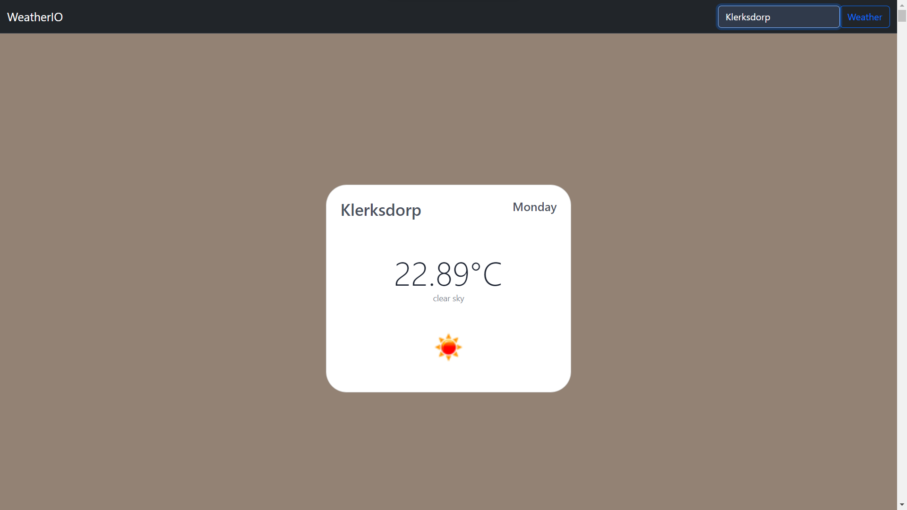
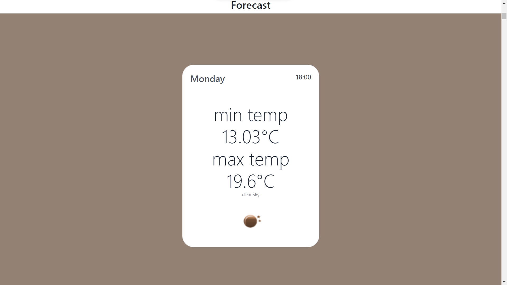

# WeatherIO  
This is a Django weather web application project that helps one get the current weather and forecast weather of any specific city.  

## Tools used: 
- Bootstrap 5
- Html, CSS, Javascript
- OpenWeatherMap API

## About 
WeatherIO is a full-stack web application that was made with the idea of helping users keep track of the current weather and get forecast weather for a specific day.  

## Features
WeatherIO makes use of the OpenWeatherMap API to allow users to get the current weather/forecast weather of any city.  

## Usage
  
 

## Acknowledgments 
The frontend was made using the Free Bootstrap Basic weather widget Template from [MDB](https://mdbootstrap.com/docs/standard/extended/weather/)
